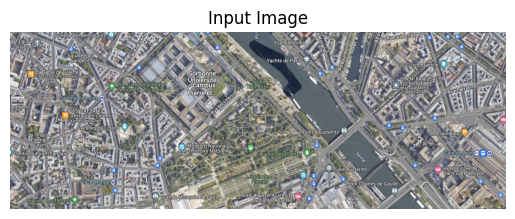
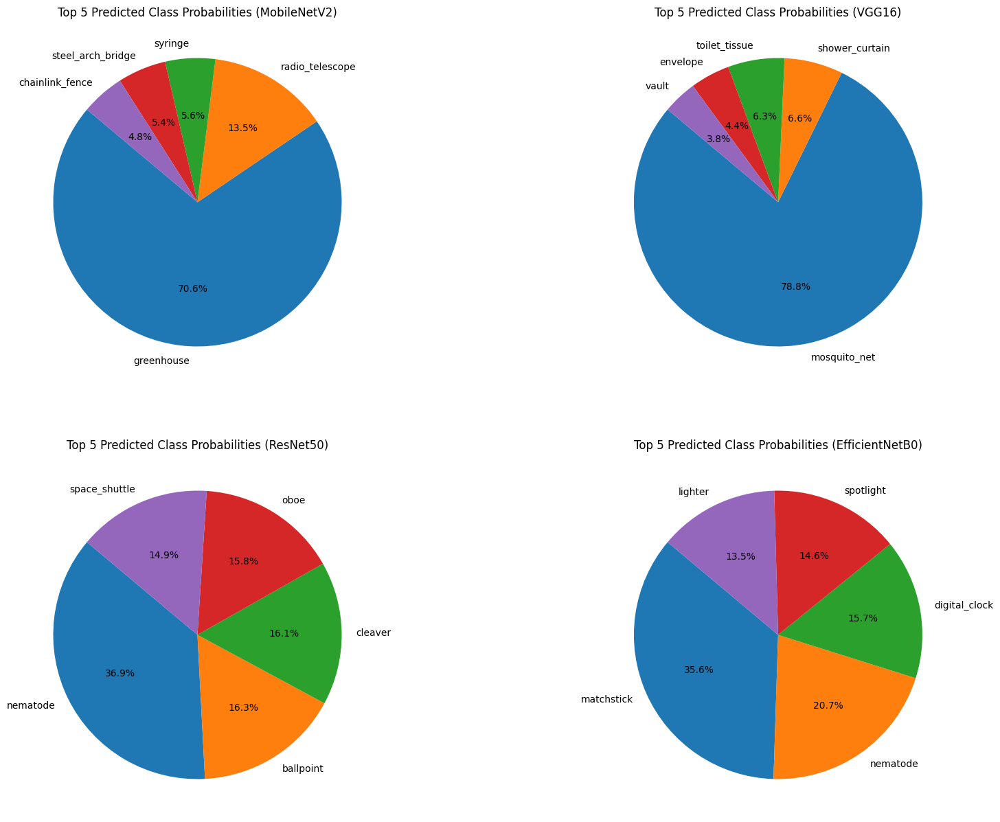

[](https://pypi.python.org/pypi/ansicolortags/)
  
 
# Deep_Learning_Classification_Performing_inference_google_image

Once a pretrained model like ResNet or VGG has been trained or fine-tuned, it can be deployed for inference on new, unseen images. During inference, the pretrained model processes input images to predict their class labels or probabilities based on the knowledge it gained from the large-scale datasets it was trained on, such as ImageNet. This process doesn't involve updating the model's parameters but rather utilizes the learned weights to make predictions without further optimization.
Here we utilize pre-trained deep learning models (such as MobileNetV2, VGG16, ResNet50, EfficientNetB0) to classify one image of google map. However, these pretrained models are typically trained on general datasets and may not be optimized for satellite imagery data. We conducted a comparison of their performance on our dataset.


```python
import requests
from PIL import Image
import numpy as np
import matplotlib.pyplot as plt
from io import BytesIO
from keras.applications.mobilenet_v2 import MobileNetV2, preprocess_input, decode_predictions
from keras.applications.vgg16 import VGG16
from keras.applications.resnet50 import ResNet50
from keras.applications.efficientnet import EfficientNetB0

# Function to load and preprocess the image
def load_and_preprocess_image(url):
    response = requests.get(url)
    image = Image.open(BytesIO(response.content)).convert("RGB")  # Convert to RGB to remove alpha channel
    image = image.resize((224, 224))  # Resize to match the input shape expected by the models
    image_array = np.array(image)
    image_array = preprocess_input(image_array)  # Preprocess the input according to the model requirements
    image_array = np.expand_dims(image_array, axis=0)
    return image_array

# Load the image from the provided URL
image_url = "https://drive.google.com/uc?id=1M9fCKB0hpmqZsuv9fVK02lZ3095UYYwf"
input_img = load_and_preprocess_image(image_url)

# Display the loaded image
plt.imshow(Image.open(BytesIO(requests.get(image_url).content)))
plt.title("Input Image")
plt.axis('off')
plt.show()

# Load the pre-trained models
model_mobilenet = MobileNetV2(weights='imagenet')
model_vgg16 = VGG16(weights='imagenet')
model_resnet50 = ResNet50(weights='imagenet')
model_efficientnetb0 = EfficientNetB0(weights='imagenet')

# Classify the image with MobileNetV2
preds_mobilenet = model_mobilenet.predict(input_img)
top_5_preds_mobilenet = decode_predictions(preds_mobilenet, top=5)[0]
class_names_mobilenet = [class_name for _, class_name, _ in top_5_preds_mobilenet]
class_probs_mobilenet = [class_prob for _, _, class_prob in top_5_preds_mobilenet]

# Classify the image with VGG16
preds_vgg16 = model_vgg16.predict(input_img)
top_5_preds_vgg16 = decode_predictions(preds_vgg16, top=5)[0]
class_names_vgg16 = [class_name for _, class_name, _ in top_5_preds_vgg16]
class_probs_vgg16 = [class_prob for _, _, class_prob in top_5_preds_vgg16]

# Classify the image with ResNet50
preds_resnet50 = model_resnet50.predict(input_img)
top_5_preds_resnet50 = decode_predictions(preds_resnet50, top=5)[0]
class_names_resnet50 = [class_name for _, class_name, _ in top_5_preds_resnet50]
class_probs_resnet50 = [class_prob for _, _, class_prob in top_5_preds_resnet50]

# Classify the image with EfficientNetB0
preds_efficientnetb0 = model_efficientnetb0.predict(input_img)
top_5_preds_efficientnetb0 = decode_predictions(preds_efficientnetb0, top=5)[0]
class_names_efficientnetb0 = [class_name for _, class_name, _ in top_5_preds_efficientnetb0]
class_probs_efficientnetb0 = [class_prob for _, _, class_prob in top_5_preds_efficientnetb0]

# Plotting the probabilities in separate pie charts for each model
plt.figure(figsize=(20, 15))

# Plot for MobileNetV2
plt.subplot(2, 2, 1)
plt.pie(class_probs_mobilenet, labels=class_names_mobilenet, autopct='%1.1f%%', startangle=140)
plt.title("Top 5 Predicted Class Probabilities (MobileNetV2)")

# Plot for VGG16
plt.subplot(2, 2, 2)
plt.pie(class_probs_vgg16, labels=class_names_vgg16, autopct='%1.1f%%', startangle=140)
plt.title("Top 5 Predicted Class Probabilities (VGG16)")

# Plot for ResNet50
plt.subplot(2, 2, 3)
plt.pie(class_probs_resnet50, labels=class_names_resnet50, autopct='%1.1f%%', startangle=140)
plt.title("Top 5 Predicted Class Probabilities (ResNet50)")

# Plot for EfficientNetB0
plt.subplot(2, 2, 4)
plt.pie(class_probs_efficientnetb0, labels=class_names_efficientnetb0, autopct='%1.1f%%', startangle=140)
plt.title("Top 5 Predicted Class Probabilities (EfficientNetB0)")

plt.show()

```


    

    


    WARNING:tensorflow:5 out of the last 5 calls to <function Model.make_predict_function.<locals>.predict_function at 0x7e4d6638aef0> triggered tf.function retracing. Tracing is expensive and the excessive number of tracings could be due to (1) creating @tf.function repeatedly in a loop, (2) passing tensors with different shapes, (3) passing Python objects instead of tensors. For (1), please define your @tf.function outside of the loop. For (2), @tf.function has reduce_retracing=True option that can avoid unnecessary retracing. For (3), please refer to https://www.tensorflow.org/guide/function#controlling_retracing and https://www.tensorflow.org/api_docs/python/tf/function for  more details.


    1/1 [==============================] - 1s 1s/step


    WARNING:tensorflow:6 out of the last 6 calls to <function Model.make_predict_function.<locals>.predict_function at 0x7e4d6610c940> triggered tf.function retracing. Tracing is expensive and the excessive number of tracings could be due to (1) creating @tf.function repeatedly in a loop, (2) passing tensors with different shapes, (3) passing Python objects instead of tensors. For (1), please define your @tf.function outside of the loop. For (2), @tf.function has reduce_retracing=True option that can avoid unnecessary retracing. For (3), please refer to https://www.tensorflow.org/guide/function#controlling_retracing and https://www.tensorflow.org/api_docs/python/tf/function for  more details.


    1/1 [==============================] - 1s 889ms/step
    1/1 [==============================] - 1s 1s/step
    1/1 [==============================] - 4s 4s/step


    

    

